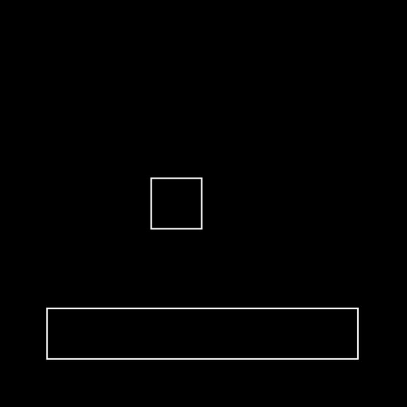

# stormfield - A Pygame Library
**Stormfield aims to partially recreate Love2D's windfield physics library.** <br/>
**The main idea behind it is to easily intergrate collisions in your game**


> [!NOTE]
> `Stormfield` is still in development, some expected features may not be present.

> [!IMPORTANT]
> The main reason i created `stormfield` was to easily manage collisions and collision classes, **NOT** to handle full physics — although some physics features are present.

# Contents
- [Instalation](#instalation)
- [Quick Start](#quick-start)
  - [Create a world](#create-a-world)
  - [Create colliders](#create-colliders)

## Instalation
```bash
git clone https://github.com/clxakz/stormfield/
```
or
```bash
pip install stormfield
```

# Quick Start
place the `stormfield` folder inside your project and import it:
```python
from stormfield import World
```

# Create a world
A physics world can be created similarly to windfield
```python
world = World(pygame.Vector2(0, 500))
```

# Create colliders
A collider is a single object that attaches to your sprite
```python
box = world.newRectangleCollider(300, 350, 100, 100)
box.setRestitution(0.8)
box.applyLinearImpulse(pygame.Vector2(0, 1000))

ground = world.newRectangleCollider(100, 600, 600, 100)
ground.setType("static") # <- Types can be 'static', 'dynamic' or 'kinematic'. Defaults to 'dynamic'

# In your main loop
world.update(dt)
world.draw(screen) # <- The world can be drawn for debugging purposes
```
And that looks like this <br/>


